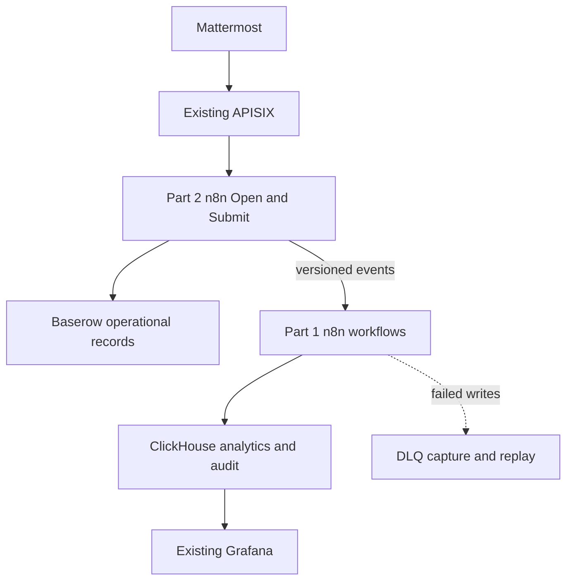

# Daily Check-in Platform — Part 1

[](https://github.com/jemmie2025/daily-checkin-part1-platform/actions/workflows/validate.yml)
[](https://github.com/jemmie2025/daily-checkin-part1-platform/actions/workflows/security.yml)
[](docs/phase-plan.md)

Configuration-first delivery for Task #5585. This repository configures the
company-managed APISIX, Vault, Nomad, Consul, n8n, Baserow, ClickHouse, Loki,
and Grafana services; it does not provision or replace them. Superset, Strapi,
and Airflow are not used.

## Integration architecture



The request path is independent of analytics. ClickHouse or Grafana failure
cannot prevent an otherwise valid check-in from being accepted. Baserow remains
the operational source; ClickHouse is the final privacy-safe analytics and audit
destination.

## Part 1 configuration

| Area | Configuration delivered |
|---|---|
| APISIX | Separate POST-only Open and Submit routes, Nomad CIDR allowlist, 64 KiB body limit, distributed 10 requests/minute per-user rate limit, TLS, privacy-safe logs, and sub-two-second Open timeouts |
| Vault/Nomad | Exact-path KV v2 policies under `kv/n8n/mattermost/checkin`, claim-bound workload roles, isolated task identities, runtime templates, and rotation-aware secret delivery |
| Compliance | SLA −60 minute nudge, SLA breach PI-6 violation, SLA +24 hour pod digest, weekly rollup, timezone conversion, leave/holiday suppression, and deterministic idempotency |
| DLQ | Three bounded write attempts, durable n8n failure retention, `checkin_dlq` mirror, verbatim private user DM, five-minute reconciliation, leased replay, and resume-from-failed-stage recovery |
| ClickHouse/Grafana | Authenticated event ingestion, schema validation, deduplication, 24-month detail retention, aggregate history, security-definer reporting views, and a six-panel Grafana dashboard |
| Observability | Privacy-safe metrics, Loki-compatible logs, five SLOs, recording rules, nine owned alerts, and operational runbooks |
| Security | Full-history Gitleaks scanning, authorised-target Strix testing, passive ZAP checks, SHA-pinned GitHub Actions, and least-privilege CI permissions |

## Ownership and write boundaries

- Tan's Part 2 owns the Mattermost `/ci` dialog, Open and Submit Handlers,
  FMT-1–FMT-8 validation, `checkins` persistence, and threaded channel posting.
- Part 1 consumes Part 2's versioned accepted-event contracts; neither part
  edits the other part's implementation.
- The Open Handler performs no application writes and must return HTTP 200
  within two seconds.
- Only Submit writes `checkins`; only Compliance writes
  `checkin_violations`; only the Submit Error Workflow writes `checkin_dlq`.
- Rejected submissions never reach Baserow or the pod channel.

The authoritative boundary is
[`contracts/ownership.yaml`](contracts/ownership.yaml).

## DLQ and ClickHouse data policy

After three failed attempts, n8n retains the complete failed execution. The DLQ
workflow sends the user's input privately, mirrors the failure to Baserow when
available, and replays only the failed side effect with the original correlation
and idempotency keys.

ClickHouse receives opened, submitted, rejected and cancelled events; expected
check-in facts; PI-6 violation lifecycle facts; and DLQ lifecycle facts. It never
receives task content, proof URLs, usernames, tokens, nonces or raw DLQ input.

## Validation

Requirements: Python 3.11+ and Node.js 20+.

```bash
python3 -m pip install -r requirements-dev.txt
make validate
```

Validated checkpoint results:

- 171 automated tests passed.
- 185 release files verified.
- APISIX, Vault/Nomad and n8n renders are deterministic.
- JSON, YAML, event, privacy, idempotency and security contracts pass.
- GitHub validation and security workflows are green.

## Delivery status

| Phase | Status |
|---|---|
| 1. Foundation and contracts | Locally validated |
| 2. APISIX configuration | Locally validated; staging application pending |
| 3. Vault/Nomad security | Locally validated; staging application pending |
| 4. Compliance automation | Locally validated |
| 5–7. DLQ, analytics and production hardening | Prepared; separate acceptance pending |

This checkpoint does not claim live deployment. Staging application, integration
with Part 2, latency/load evidence and security testing require the company
access listed in [`docs/access-required.md`](docs/access-required.md).

Detailed design: [`docs/architecture.md`](docs/architecture.md) · Phase gates:
[`docs/phase-plan.md`](docs/phase-plan.md) · Runbooks:
[`docs/runbooks`](docs/runbooks) · Repository map:
[`docs/folder-structure.md`](docs/folder-structure.md)
