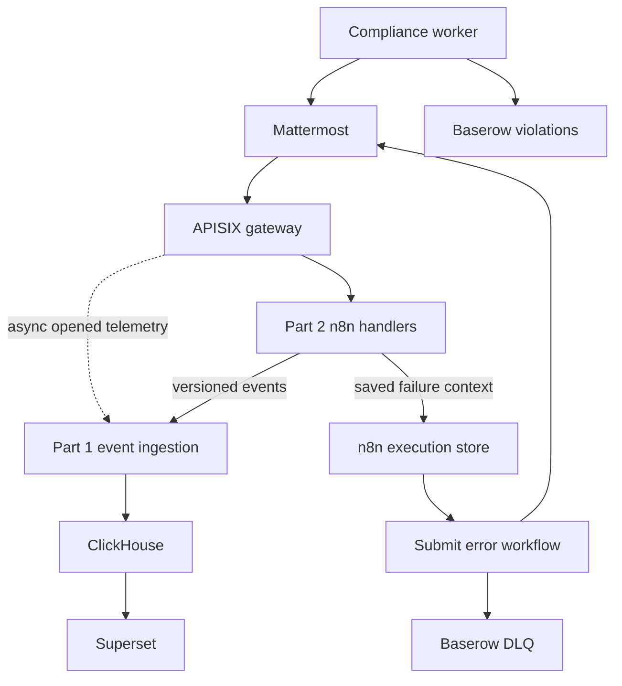

# Part 1 Architecture

## System boundary



The solid request path remains independent of analytics. ClickHouse or Superset
failure must not prevent a valid check-in from being accepted.

## Write-authority matrix

| Component | `checkins` | `checkin_violations` | `checkin_dlq` | ClickHouse |
|---|---:|---:|---:|---:|
| Open Handler | Never | Never | Never | Never |
| Submit Handler | Create/amend only | Never | Never | Event contract only |
| Compliance Worker | Never | Create/update | Never | No direct table write |
| Submit Error Workflow | Never | Never | Create/update | No raw-input event |
| Event Ingestion | Never | Never | Never | Insert only |
| Superset | Never | Never | Never | Read only |

## Request trust sequence

1. APISIX checks method, TLS, request size, and source network.
2. APISIX strictly parses `user_id`, overwrites spoofable internal headers, and
   uses that value as the per-user abuse-throttling key.
3. n8n verifies the Mattermost token/signature before business processing and
   checks that the gateway identity matches the payload.
4. Only the minimum required headers and body are forwarded to n8n.
5. Sensitive fields are excluded from access telemetry.

The gateway-derived user key is not an authorization decision. Its trust is
bounded by the source CIDR; n8n authentication remains mandatory.

## Vault trust boundaries

| Nomad task | Readable KV v2 objects | Downstream authority |
|---|---|---|
| APISIX | `apisix` | Redis quota store; telemetry transport |
| n8n Open | `open`, `dialog-shared` | Open bot; command verification; SLA read |
| n8n Submit | `submit`, `dialog-shared` | `checkins` writer; submit bot; event producer |
| n8n Compliance | `compliance` | `checkin_violations` writer; roster/calendar reads |
| n8n DLQ | `dlq` | `checkin_dlq` writer; failure DM bot |
| n8n Analytics | `analytics`, `event-shared` | Event validation; ClickHouse insert-only identity |

Each role is bound to exact Nomad namespace, job, task, Vault role, and
`vault.io` audience claims. Vault policies grant only exact-path `read`; applications cannot list,
write, delete, or inspect metadata. The Nomad task receives rendered service
credentials, not the Vault token. A single n8n worker may not execute more than
one trust class.

## Compliance truth model

Compliance is calculated from two sets:

```text
missing = expected_checkins(active roster - leave - holidays) - accepted_checkins
```

At SLA −60 minutes, members of `missing` receive a nudge. At SLA, each remaining
member produces one idempotent `PI-6` violation. At SLA +24 hours, unresolved
violations are grouped into a pod-lead digest. A late submission remains a real
`checkins` row with `sla_status=late`; the compliance worker may resolve the
related violation without altering `checkins`.

## Delivery and idempotency

- Gateway and workflow delivery is treated as at-least-once.
- Events deduplicate by `event_id`.
- PI-6 violations deduplicate by
  `user_id|cycle_date|checkin_type|rule_id`.
- DLQ records deduplicate by `source_execution_id|failure_stage`.
- A five-minute saved-execution reconciliation pass repairs a DLQ mirror missed
  while Baserow is unavailable; `dlq_id` is also unique in Baserow.
- A private pending/replaying Baserow view bounds replay scans so retained
  resolved rows cannot starve recovery candidates.
- Replays reuse the original `correlation_id` and use `replay_key` to prevent a
  second `checkins` row or duplicate Mattermost post.

## Data minimization

ClickHouse receives operational metadata and counts only. It must not receive
`tasks_md`, `tasks_json`, proof URLs, usernames, dialog state, nonces, or raw
submission bodies. DLQ raw input is restricted, redacted from logs, and deleted
according to the approved recovery retention policy.

ClickHouse detail expires after 24 months. Before expiry, refreshable views copy
aggregate-only daily metrics into no-TTL archive tables; Superset queries only
security-definer reporting views that union recent and archived aggregates.
