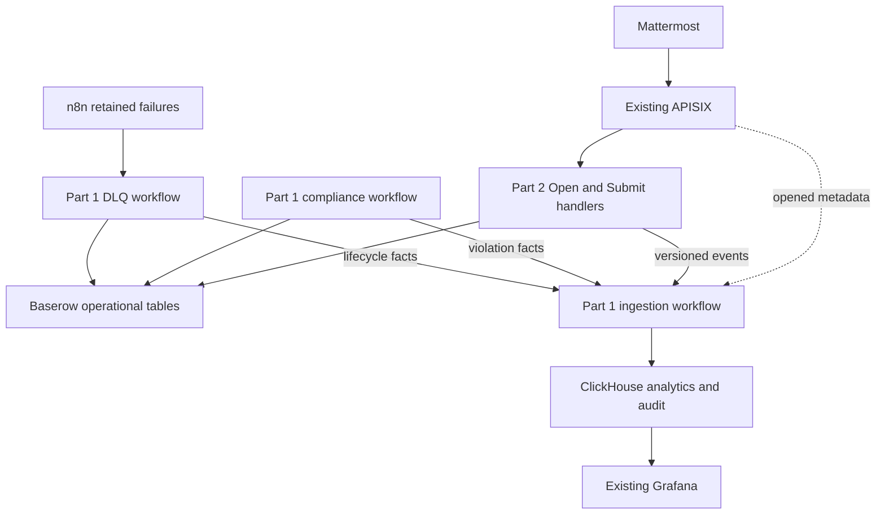

# Part 1 Configuration Architecture

## Existing-platform boundary

Task #5585 reuses the company-managed APISIX, Vault, Nomad, Consul, n8n,
Baserow, ClickHouse, Loki, and Grafana services. Part 1 supplies reviewed
configuration overlays, contracts, workflows, dashboards, and verification; it
does not install or replace those platforms. Airflow and Superset are outside
the approved design.



The request path is independent of analytics. A ClickHouse or Grafana failure
must never prevent a valid check-in from being accepted. Baserow remains the
operational source required by the master plan; ClickHouse receives a
privacy-minimized analytical copy of check-in events, expectations, violation
facts, and DLQ lifecycle facts.

## Connection configuration

1. Mattermost sends Open and Submit callbacks through separate APISIX routes.
2. APISIX applies the reviewed route/plugin overlay and forwards to the
   existing n8n upstream registered through Consul.
3. Part 2 writes accepted submissions to Baserow and publishes the versioned
   check-in event contract to the Part 1 ingestion webhook.
4. The compliance workflow compares expected staff with accepted check-ins,
   writes only `checkin_violations`, and publishes a minimized violation fact.
5. The DLQ workflow retains failed Submit executions, mirrors them into
   `checkin_dlq` when Baserow is available, and publishes lifecycle metadata
   without the raw submission.
6. The ingestion workflow validates, deduplicates, and inserts `JSONEachRow`
   over TLS into ClickHouse using an insert-only identity delivered by Vault.
7. The existing Grafana instance queries security-definer reporting views using
   a read-only ClickHouse identity.

## Write-authority matrix

| Component | `checkins` | `checkin_violations` | `checkin_dlq` | ClickHouse |
|---|---:|---:|---:|---:|
| Open Handler | Never | Never | Never | Never |
| Submit Handler | Create/amend only | Never | Never | Event contract only |
| Compliance Worker | Never | Create/update | Never | Fact contract only |
| Submit Error Workflow | Never | Never | Create/update | Lifecycle contract only |
| Event Ingestion | Never | Never | Never | Insert only |
| Grafana | Never | Never | Never | Reporting views only |

## Request trust sequence

1. APISIX checks method, TLS, request size, and source network.
2. APISIX strictly parses `user_id`, overwrites spoofable internal headers, and
   uses that value as the per-user throttling key.
3. n8n verifies the Mattermost token/signature and confirms that the gateway
   identity matches the payload before business processing.
4. Only the minimum required headers and body are forwarded to n8n.
5. Raw tasks, proof links, dialog state, nonces, and credentials are excluded
   from access logs and ClickHouse.

## Existing Vault and Nomad integration

Part 1 configures least-privilege policies and workload-role bindings in the
existing Vault/Nomad installation. It does not provision Vault, Nomad, or
Consul. Each workload reads only its approved KV v2 object and receives rendered
service credentials rather than a Vault token.

| Workload | Secret scope | Downstream authority |
|---|---|---|
| APISIX | `apisix` | Existing quota store and telemetry transport |
| n8n Open | `open`, `dialog-shared` | Open bot and command verification |
| n8n Submit | `submit`, `dialog-shared` | `checkins` writer and event producer |
| n8n Compliance | `compliance` | `checkin_violations` writer and source reads |
| n8n DLQ | `dlq` | `checkin_dlq` writer and failure DM bot |
| n8n Ingestion | `analytics`, `event-shared` | ClickHouse insert-only identity |

## Compliance and failure configuration

Compliance is computed as:

```text
missing = expected_checkins(active roster - leave - holidays) - accepted_checkins
```

At SLA minus 60 minutes, missing users receive a nudge. At SLA, each remaining
user produces one idempotent PI-6 violation. At SLA plus 24 hours, unresolved
violations are grouped into a pod-lead digest.

After three bounded write attempts, the complete failed submission remains in
the n8n execution store. The error workflow sends the private verbatim-input DM
and creates the deterministic Baserow DLQ row when Baserow is reachable. A
five-minute reconciliation job repairs missed mirrors. Replay resumes at the
failed side effect and reuses the original correlation and idempotency keys.

## ClickHouse and Grafana model

ClickHouse is the final analytical and audit layer for:

- check-in opened, submitted, rejected, and cancelled events;
- expected staff/cycle facts used to calculate compliance;
- PI-6 violation lifecycle facts; and
- DLQ queued, replaying, resolved, and abandoned lifecycle facts.

ClickHouse never receives task Markdown, parsed task bodies, proof URLs,
usernames, nonces, tokens, or raw DLQ submissions. Detail expires after 24
months; aggregate-only history is retained through refreshable views. Grafana
queries only reviewed reporting views and has no access to raw tables.

## Security gates

Gitleaks scans the complete Git history for credentials. Strix runs only against
an explicitly authorised repository or staging target, in non-interactive mode,
with credentials supplied by the company secret store. Strix is not run from an
untrusted fork and never receives production credentials.
